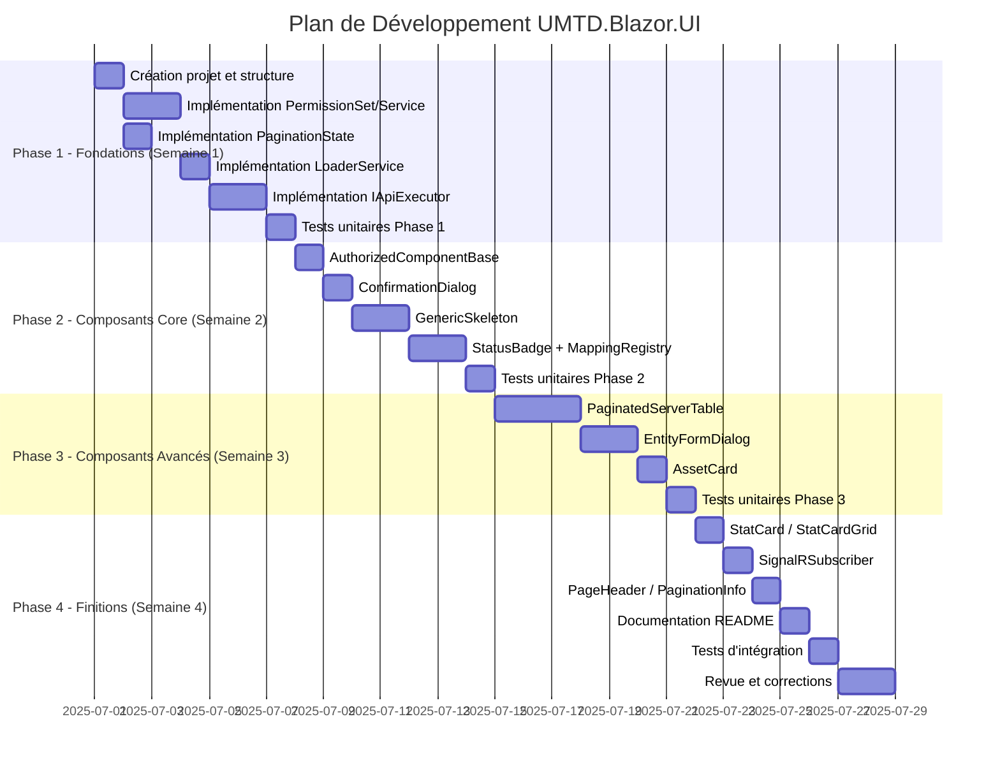

# 📋 Cahier des Charges
## Bibliothèque de Composants UI Blazor
### UMTD.Blazor.UI

---

> **Version** : 1.0  
> **Date** : Juin 2025  
> **Statut** : À Valider  
> **Auteur** : Équipe UMTD - OTR  
> **Projet Parent** : Gestion des Particuliers

---

## Table des Matières

1. [Introduction](#1-introduction)
2. [Contexte et Objectifs](#2-contexte-et-objectifs)
3. [Périmètre du Projet](#3-périmètre-du-projet)
4. [Exigences Fonctionnelles](#4-exigences-fonctionnelles)
5. [Exigences Techniques](#5-exigences-techniques)
6. [Spécifications des Composants](#6-spécifications-des-composants)
7. [Spécifications des Services](#7-spécifications-des-services)
8. [Spécifications des DTOs et Modèles](#8-spécifications-des-dtos-et-modèles)
9. [Architecture Technique](#9-architecture-technique)
10. [Conventions et Standards](#10-conventions-et-standards)
11. [Plan de Développement](#11-plan-de-développement)
12. [Critères d'Acceptation](#12-critères-dacceptation)
13. [Livrables](#13-livrables)
14. [Annexes](#14-annexes)

---

## 1. Introduction

### 1.1 Objet du Document

Ce cahier des charges définit les spécifications techniques et fonctionnelles pour la création d'une **bibliothèque de composants UI Blazor réutilisables** nommée `UMTD.Blazor.UI`. Cette librairie vise à mutualiser les composants communs identifiés dans le projet "Gestion des Particuliers" et à établir une base solide pour les futurs développements Blazor de l'OTR.

### 1.2 Périmètre Documentaire

Ce document couvre :
- ✅ Les spécifications fonctionnelles des composants
- ✅ Les spécifications techniques d'implémentation
- ✅ L'architecture cible de la librairie
- ✅ Les conventions de développement
- ✅ Le plan de développement phasé
- ✅ Les critères d'acceptation

### 1.3 Documents de Référence

| Document | Description |
|----------|-------------|
| `ANALYSE_BLAZOR_UI_REPORT.md` | Analyse des duplications et patterns du projet existant |
| `OPTIMISATION_COMPOSANTS_EXISTANTS.md` | Analyse et optimisation des composants existants |
| Documentation MudBlazor | https://mudblazor.com/docs |
| Documentation Blazor | https://learn.microsoft.com/aspnet/core/blazor |

### 1.4 Glossaire

| Terme | Définition |
|-------|------------|
| **UMTD** | Full Stack Hero - Framework de base du projet |
| **OTR** | Office Togolais des Recettes |
| **TIN** | Taxpayer Identification Number (NIF) |
| **CRUD** | Create, Read, Update, Delete |
| **DTO** | Data Transfer Object |
| **Skeleton** | Composant de chargement animé |

---

## 2. Contexte et Objectifs

### 2.1 Contexte

L'analyse du projet "Gestion des Particuliers" a révélé des duplications significatives de code dans l'application Blazor WebAssembly :

| Problème Identifié | Impact | Fichiers Concernés |
|-------------------|--------|-------------------|
| Code d'autorisation dupliqué | Maintenabilité critique | ~20+ fichiers |
| Logique de pagination répétée | Évolutivité limitée | ~15+ listes |
| Dialogs Add/Edit quasi-identiques | Temps de développement | ~25+ dialogs |
| Skeletons non paramétrables | Duplication massive | 13 fichiers |
| Mappings couleur/statut dispersés | Incohérence UI | ~10 fichiers |
| Utilisation de `dynamic` | Perte de type-safety | 4+ fichiers |

### 2.2 Objectifs du Projet

#### 2.2.1 Objectifs Principaux

| # | Objectif | Indicateur de Succès |
|---|----------|---------------------|
| O1 | Réduire la duplication de code | Réduction de 90% des lignes dupliquées |
| O2 | Améliorer la maintenabilité | Correction d'un bug = 1 seul fichier |
| O3 | Garantir la cohérence UI | Design System unifié |
| O4 | Accélérer le développement | Temps création nouvelle page -80% |
| O5 | Faciliter les tests | Composants isolés et testables |

#### 2.2.2 Objectifs Secondaires

- Fournir une documentation complète (XML docs + README)
- Permettre la personnalisation via des options de configuration
- Supporter la localisation (FR par défaut, extensible)
- Être compatible avec les futures versions de .NET

### 2.3 Contraintes

| Contrainte | Description |
|------------|-------------|
| **Technologique** | .NET 10, Blazor WebAssembly, MudBlazor 7.x |
| **Compatibilité** | Doit être compatible avec le projet existant |
| **Performance** | Pas de régression de performance mesurable |
| **Délai** | Livraison Phase 1 en 3 semaines |

---

## 3. Périmètre du Projet

### 3.1 Dans le Périmètre (In Scope)

#### Composants UI
- ✅ Composant de base autorisé (`AuthorizedComponentBase`)
- ✅ Table paginée serveur générique (`PaginatedServerTable`)
- ✅ Dialog de formulaire générique (`EntityFormDialog`)
- ✅ Dialog de confirmation amélioré (`ConfirmationDialog`)
- ✅ Carte de bien générique (`AssetCard`)
- ✅ Badge de statut générique (`StatusBadge`)
- ✅ Skeleton paramétrable (`GenericSkeleton`)
- ✅ Composant d'abonnement SignalR (`SignalRSubscriber`)
- ✅ Carte statistique (`StatCard`)
- ✅ En-tête de page (`PageHeader`)
- ✅ Info de pagination (`PaginationInfo`)
- ✅ Overlay de chargement (`LoadingOverlay`)

#### Services
- ✅ Service d'exécution API (`IApiExecutor`)
- ✅ Service de permissions (`IPermissionService`)
- ✅ Service de chargement (`LoaderService`)
- ✅ Registry de mappings statut (`StatusMappingRegistry`)

#### DTOs et Modèles
- ✅ État de pagination (`PaginationState`)
- ✅ Ensemble de permissions (`PermissionSet`)
- ✅ Mapping de statut (`StatusMapping<T>`)
- ✅ Configuration de dialog (`DialogConfiguration`)
- ✅ Données de carte statistique (`StatCardData`)
- ✅ Localisation de table (`TableLocalization`)

### 3.2 Hors Périmètre (Out of Scope)

- ❌ Migration du projet existant (projet séparé)
- ❌ Composants métier spécifiques (VehiculeCard, ImmobilierCard, etc.)
- ❌ Client API généré (reste dans le projet consommateur)
- ❌ Authentification/Autorisation (utilise les services existants)
- ❌ Thème MudBlazor (reste configurable par le consommateur)

### 3.3 Dépendances Externes

| Dépendance | Version | Obligatoire | Usage |
|------------|---------|-------------|-------|
| MudBlazor | 7.x | ✅ Oui | Framework UI de base |
| Fluxor.Blazor.Web | 6.x | ❌ Non | Gestion d'état (FeatureGate) |
| Microsoft.AspNetCore.Components.Authorization | 10.x | ✅ Oui | Autorisations |
| Microsoft.Extensions.Logging | 10.x | ✅ Oui | Logging |

---

## 4. Exigences Fonctionnelles

### 4.1 EF-001 : Gestion des Autorisations

**Priorité** : 🔴 Critique

**Description** : Fournir un mécanisme centralisé pour vérifier les permissions CRUD sur une ressource.

**Règles métier** :
- R1 : Les permissions doivent être vérifiées au chargement du composant
- R2 : Les boutons/actions non autorisés doivent être masqués (pas désactivés)
- R3 : Chaque composant doit pouvoir spécifier sa ressource
- R4 : Support des permissions : Create, Read, Update, Delete, Search, Export, Submit, Pay

**Critères d'acceptation** :
- [ ] Un composant peut hériter de `AuthorizedComponentBase`
- [ ] Les permissions sont chargées automatiquement dans `OnInitializedAsync`
- [ ] L'ensemble `PermissionSet` est accessible dans les composants enfants
- [ ] Les permissions sont cachées si non chargées

---

### 4.2 EF-002 : Table Paginée Serveur

**Priorité** : 🔴 Critique

**Description** : Composant de table avec pagination côté serveur, recherche, et actions CRUD intégrées.

**Règles métier** :
- R1 : La pagination utilise les paramètres `PageNumber` et `PageSize`
- R2 : La recherche est débounced (300ms)
- R3 : Le tri est géré côté serveur
- R4 : Les boutons Créer/Modifier/Supprimer respectent les permissions
- R5 : Un skeleton est affiché pendant le chargement

**Critères d'acceptation** :
- [ ] La table affiche les données paginées depuis le serveur
- [ ] La barre de recherche filtre les résultats avec délai
- [ ] Les colonnes sont triables si spécifié
- [ ] Le bouton "Ajouter" ouvre le dialog de création
- [ ] Les actions de ligne (Modifier/Supprimer) fonctionnent
- [ ] Un skeleton s'affiche pendant le chargement initial
- [ ] Le message "Aucun résultat" s'affiche si liste vide

---

### 4.3 EF-003 : Dialog de Formulaire Générique

**Priorité** : 🔴 Critique

**Description** : Dialog réutilisable pour la création et modification d'entités.

**Règles métier** :
- R1 : Un seul composant gère création ET modification
- R2 : Le mode est déterminé par le paramètre `IsCreate`
- R3 : La validation côté client est supportée
- R4 : Les erreurs serveur sont affichées
- R5 : Un indicateur de chargement s'affiche pendant la sauvegarde

**Critères d'acceptation** :
- [ ] Le dialog s'ouvre avec le bon titre (Créer/Modifier)
- [ ] Le formulaire est pré-rempli en mode édition
- [ ] La validation bloque la soumission si invalide
- [ ] Les erreurs serveur sont affichées dans le formulaire
- [ ] Le dialog se ferme après sauvegarde réussie
- [ ] Un toast de succès s'affiche

---

### 4.4 EF-004 : Dialog de Confirmation

**Priorité** : 🟠 Haute

**Description** : Dialog standardisé pour les confirmations d'actions.

**Règles métier** :
- R1 : Trois types de confirmation : Info, Warning, Danger
- R2 : Le type détermine la couleur du bouton de confirmation
- R3 : Le message peut être du HTML simple
- R4 : Les textes des boutons sont personnalisables

**Critères d'acceptation** :
- [ ] Le dialog affiche le titre et le message
- [ ] La couleur correspond au type (Primary/Warning/Error)
- [ ] Les boutons affichent les textes personnalisés
- [ ] Le résultat (OK/Cancel) est retourné correctement
- [ ] L'extension `IDialogService.ConfirmAsync()` est disponible

---

### 4.5 EF-005 : Skeleton Paramétrable

**Priorité** : 🟠 Haute

**Description** : Composant de chargement configurable remplaçant les 13 skeletons existants.

**Règles métier** :
- R1 : Support des layouts : Card, CardGrid, Table, Form, FormDialog, Dashboard, Custom
- R2 : Le nombre d'éléments est paramétrable
- R3 : Un template personnalisé peut être fourni

**Critères d'acceptation** :
- [ ] Chaque layout produit un rendu approprié
- [ ] Le nombre de cartes/lignes correspond au paramètre `Count`
- [ ] Le template personnalisé est utilisé si fourni
- [ ] L'animation est fluide (Wave)

---

### 4.6 EF-006 : Badge de Statut

**Priorité** : 🟡 Moyenne

**Description** : Chip coloré affichant un statut avec icône et label.

**Règles métier** :
- R1 : Le mapping statut → (couleur, icône, label) est fourni via un provider
- R2 : L'icône et le label sont optionnellement masquables
- R3 : La taille et la variante sont personnalisables

**Critères d'acceptation** :
- [ ] Le chip affiche la bonne couleur pour le statut
- [ ] L'icône correspond au statut
- [ ] Le label est affiché si demandé
- [ ] Les providers existants fonctionnent (DeclarationStatus, etc.)

---

### 4.7 EF-007 : Carte de Bien Générique

**Priorité** : 🟡 Moyenne

**Description** : Composant de carte standardisé pour les biens du contribuable.

**Règles métier** :
- R1 : Structure uniforme : Header, Body, Footer, Actions
- R2 : Les actions respectent les permissions
- R3 : Les dialogs d'édition/détails sont ouverts automatiquement
- R4 : Le callback `OnActionCompleted` est appelé après chaque action

**Critères d'acceptation** :
- [ ] La carte affiche les templates fournis
- [ ] Les boutons Edit/Delete respectent les permissions
- [ ] Le dialog d'édition s'ouvre au clic sur Modifier
- [ ] La suppression affiche une confirmation
- [ ] Le callback est appelé après action

---

### 4.8 EF-008 : Abonnement SignalR

**Priorité** : 🟢 Basse

**Description** : Composant encapsulant la logique d'abonnement aux événements temps réel.

**Règles métier** :
- R1 : Connexion automatique au hub si `AutoConnect=true`
- R2 : Rejoindre un groupe identifié par `GroupId`
- R3 : Écouter l'événement `EventName`
- R4 : Nettoyage automatique au Dispose

**Critères d'acceptation** :
- [ ] La connexion au hub est établie automatiquement
- [ ] L'événement `OnEventReceived` est déclenché
- [ ] La déconnexion est gérée proprement
- [ ] La reconnexion automatique fonctionne

---

### 4.9 EF-009 : Cartes Statistiques

**Priorité** : 🟢 Basse

**Description** : Composants pour afficher des indicateurs chiffrés.

**Règles métier** :
- R1 : Support des types : Number, Currency, Percentage, Decimal
- R2 : Formatage selon la culture FR
- R3 : Affichage d'une valeur principale et d'une sous-valeur

**Critères d'acceptation** :
- [ ] Les nombres sont formatés avec séparateurs de milliers
- [ ] Les montants affichent le symbole monétaire
- [ ] L'icône et la couleur correspondent aux paramètres
- [ ] Le grid de cartes calcule automatiquement les colonnes

---

## 5. Exigences Techniques

### 5.1 ET-001 : Framework et Versions

| Technologie | Version | Justification |
|-------------|---------|---------------|
| .NET | 10.0 | Version cible du projet parent |
| Blazor WebAssembly | 10.0 | Mode d'exécution |
| C# | 14.0 | Dernières fonctionnalités (primary constructors, etc.) |
| MudBlazor | 7.x | Framework UI existant |

### 5.2 ET-002 : Structure du Projet

```
UMTD.Blazor.UI/
├── UMTD.Blazor.UI.csproj          # Projet principal (Razor Class Library)
├── _Imports.razor                # Imports globaux
├── README.md                     # Documentation d'utilisation
├── CHANGELOG.md                  # Journal des modifications
│
├── 📁 Components/                 # Composants Razor
│   ├── 📁 Base/                   # Classes de base
│   ├── 📁 Tables/                 # Composants de table
│   ├── 📁 Dialogs/                # Composants de dialog
│   ├── 📁 Cards/                  # Composants de carte
│   ├── 📁 Status/                 # Composants de statut
│   ├── 📁 Loading/                # Composants de chargement
│   ├── 📁 Layout/                 # Composants de mise en page
│   └── 📁 Realtime/               # Composants temps réel
│
├── 📁 Services/                   # Services injectables
│   ├── 📁 Api/                    # Services d'exécution API
│   ├── 📁 Permissions/            # Services d'autorisation
│   └── 📁 Loading/                # Services de chargement
│
├── 📁 Models/                     # DTOs et modèles
│   ├── 📁 Pagination/             # Modèles de pagination
│   ├── 📁 Permissions/            # Modèles d'autorisation
│   ├── 📁 Status/                 # Modèles de statut
│   └── 📁 Configuration/          # Modèles de configuration
│
├── 📁 Mappings/                   # Providers de mapping
│   ├── IStatusMappingProvider.cs
│   ├── StatusMappingRegistry.cs
│   └── 📁 Implementations/        # Implémentations par défaut
│
├── 📁 Extensions/                 # Méthodes d'extension
│   ├── ServiceCollectionExtensions.cs
│   ├── DialogServiceExtensions.cs
│   └── EnumExtensions.cs
│
├── 📁 Enums/                      # Énumérations
│
└── 📁 wwwroot/                    # Fichiers statiques
    └── 📁 css/
        └── UMTD-blazor-ui.css      # Styles CSS
```

### 5.3 ET-003 : Fichier Projet (.csproj)

```xml
<Project Sdk="Microsoft.NET.Sdk.Razor">
  <PropertyGroup>
    <!-- Cible -->
    <TargetFramework>net10.0</TargetFramework>
    <Nullable>enable</Nullable>
    <ImplicitUsings>enable</ImplicitUsings>
    <LangVersion>14.0</LangVersion>
    
    <!-- Package NuGet -->
    <PackageId>UMTD.Blazor.UI</PackageId>
    <Version>1.0.0</Version>
    <Authors>OTR - UMTD</Authors>
    <Company>Office Togolais des Recettes</Company>
    <Product>UMTD Blazor UI Components</Product>
    <Description>Bibliothèque de composants Blazor réutilisables pour les applications OTR</Description>
    <PackageTags>blazor;mudblazor;components;ui;otr</PackageTags>
    <PackageProjectUrl>https://gitlab.otr.tg/umtd/UMTD-blazor-ui</PackageProjectUrl>
    <RepositoryUrl>https://gitlab.otr.tg/umtd/UMTD-blazor-ui.git</RepositoryUrl>
    <RepositoryType>git</RepositoryType>
    
    <!-- Documentation -->
    <GenerateDocumentationFile>true</GenerateDocumentationFile>
    <NoWarn>$(NoWarn);CS1591</NoWarn>
    
    <!-- Ressources statiques -->
    <StaticWebAssetBasePath>_content/UMTD.Blazor.UI</StaticWebAssetBasePath>
  </PropertyGroup>

  <ItemGroup>
    <SupportedPlatform Include="browser" />
  </ItemGroup>

  <ItemGroup>
    <PackageReference Include="MudBlazor" Version="7.*" />
    <PackageReference Include="Microsoft.AspNetCore.Components.Authorization" Version="10.*" />
    <PackageReference Include="Microsoft.AspNetCore.Components.Web" Version="10.*" />
    <PackageReference Include="Microsoft.Extensions.Logging.Abstractions" Version="10.*" />
    <PackageReference Include="Microsoft.AspNetCore.SignalR.Client" Version="10.*" />
  </ItemGroup>
  
  <ItemGroup>
    <!-- Optionnel : Fluxor pour FeatureGate -->
    <PackageReference Include="Fluxor.Blazor.Web" Version="6.*" Condition="'$(UseFluxor)' == 'true'" />
  </ItemGroup>
</Project>
```

### 5.4 ET-004 : Configuration et DI

```csharp
// Extensions/ServiceCollectionExtensions.cs
namespace UMTD.Blazor.UI.Extensions;

public static class ServiceCollectionExtensions
{
    /// <summary>
    /// Ajoute les services UMTD Blazor UI au conteneur de dépendances.
    /// </summary>
    public static IServiceCollection AddUMTDBlazorUI(
        this IServiceCollection services,
        Action<UMTDBlazorUIOptions>? configure = null)
    {
        var options = new UMTDBlazorUIOptions();
        configure?.Invoke(options);

        services.AddSingleton(options);
        services.AddScoped<IApiExecutor, ApiExecutor>();
        services.AddScoped<IPermissionService, PermissionService>();
        services.AddScoped<LoaderService>();
        services.AddSingleton<StatusMappingRegistry>();

        // Enregistrer les mappings par défaut si demandé
        if (options.RegisterDefaultMappings)
        {
            services.AddDefaultStatusMappings();
        }

        return services;
    }

    private static void AddDefaultStatusMappings(this IServiceCollection services)
    {
        // Les mappings seront enregistrés au démarrage
    }
}

/// <summary>
/// Options de configuration de UMTD Blazor UI.
/// </summary>
public class UMTDBlazorUIOptions
{
    /// <summary>
    /// Localisation par défaut pour les tables.
    /// </summary>
    public TableLocalization DefaultTableLocalization { get; set; } = new();
    
    /// <summary>
    /// Activer le loader global.
    /// </summary>
    public bool UseGlobalLoader { get; set; } = true;
    
    /// <summary>
    /// Format de date par défaut.
    /// </summary>
    public string DateFormat { get; set; } = "dd/MM/yyyy";
    
    /// <summary>
    /// Culture par défaut.
    /// </summary>
    public CultureInfo Culture { get; set; } = CultureInfo.GetCultureInfo("fr-FR");
    
    /// <summary>
    /// Enregistrer les mappings de statut par défaut.
    /// </summary>
    public bool RegisterDefaultMappings { get; set; } = true;
    
    /// <summary>
    /// Configuration par défaut des dialogs.
    /// </summary>
    public DialogConfiguration DefaultDialogConfiguration { get; set; } = new();
}
```

### 5.5 ET-005 : Performances

| Exigence | Seuil | Mesure |
|----------|-------|--------|
| Temps de rendu initial | < 100ms | First Contentful Paint |
| Taille du bundle | < 500KB | gzip compressé |
| Mémoire par composant | < 1MB | Heap snapshot |
| Re-renders inutiles | 0 | Blazor DevTools |

### 5.6 ET-006 : Accessibilité

- Tous les composants doivent supporter la navigation au clavier
- Les rôles ARIA doivent être correctement définis
- Le contraste doit respecter WCAG 2.1 AA (ratio 4.5:1)
- Les composants interactifs doivent avoir un focus visible

---

## 6. Spécifications des Composants

### 6.1 AuthorizedComponentBase

#### 6.1.1 Description
Classe de base abstraite pour les composants nécessitant des vérifications d'autorisation.

#### 6.1.2 API

```csharp
namespace UMTD.Blazor.UI.Components.Base;

/// <summary>
/// Classe de base pour les composants avec vérification d'autorisation.
/// </summary>
public abstract class AuthorizedComponentBase : ComponentBase
{
    /// <summary>
    /// État d'authentification en cascade.
    /// </summary>
    [CascadingParameter]
    protected Task<AuthenticationState> AuthState { get; set; } = default!;

    /// <summary>
    /// Service d'autorisation injecté.
    /// </summary>
    [Inject]
    protected IAuthorizationService AuthService { get; set; } = default!;

    /// <summary>
    /// Ressource à vérifier (ex: "Cars", "Countries").
    /// </summary>
    protected abstract string Resource { get; }
    
    /// <summary>
    /// Ensemble des permissions calculées.
    /// </summary>
    protected PermissionSet Permissions { get; private set; } = new();
    
    /// <summary>
    /// Indique si les permissions sont chargées.
    /// </summary>
    protected bool IsPermissionsLoaded { get; private set; }

    protected override async Task OnInitializedAsync()
    {
        await LoadPermissionsAsync();
        await base.OnInitializedAsync();
    }

    /// <summary>
    /// Charge les permissions pour la ressource.
    /// </summary>
    protected virtual async Task LoadPermissionsAsync()
    {
        var state = await AuthState;
        Permissions = new PermissionSet
        {
            CanCreate = await HasPermissionAsync(UMTDActions.Create, state),
            CanRead = await HasPermissionAsync(UMTDActions.View, state),
            CanUpdate = await HasPermissionAsync(UMTDActions.Update, state),
            CanDelete = await HasPermissionAsync(UMTDActions.Delete, state),
            CanSearch = await HasPermissionAsync(UMTDActions.Search, state),
            CanExport = await HasPermissionAsync(UMTDActions.Export, state),
            CanSubmit = await HasPermissionAsync(UMTDActions.Submit, state),
            CanPay = await HasPermissionAsync(UMTDActions.Pay, state)
        };
        IsPermissionsLoaded = true;
    }

    private async Task<bool> HasPermissionAsync(string action, AuthenticationState state)
        => !string.IsNullOrWhiteSpace(action) 
           && await AuthService.HasPermissionAsync(state.User, action, Resource);
}
```

#### 6.1.3 Exemple d'Utilisation

```csharp
public partial class CountriesList : AuthorizedComponentBase
{
    protected override string Resource => UMTDResources.Countries;
    
    // Permissions disponibles automatiquement
    // if (Permissions.CanCreate) { ... }
}
```

---

### 6.2 PaginatedServerTable<TEntity>

#### 6.2.1 Description
Table MudBlazor générique avec pagination côté serveur, recherche et actions CRUD.

#### 6.2.2 API

| Paramètre | Type | Requis | Défaut | Description |
|-----------|------|--------|--------|-------------|
| `Resource` | `string` | ✅ | - | Ressource UMTD pour les permissions |
| `SearchFunc` | `Func<PaginationFilter, CancellationToken, Task<PagedResult<TEntity>>>` | ✅ | - | Fonction de recherche API |
| `Columns` | `RenderFragment` | ✅ | - | Définition des colonnes (MudTh) |
| `RowTemplate` | `RenderFragment<TEntity>` | ✅ | - | Template de ligne (MudTd) |
| `Title` | `string` | ❌ | `""` | Titre affiché |
| `CreateDialogType` | `Type?` | ❌ | `null` | Type du dialog de création |
| `EditDialogType` | `Type?` | ❌ | `null` | Type du dialog d'édition |
| `DeleteFunc` | `Func<TEntity, Task<bool>>?` | ❌ | `null` | Fonction de suppression |
| `IdFunc` | `Func<TEntity, object>?` | ❌ | `null` | Fonction d'extraction de l'ID |
| `ActionsTemplate` | `RenderFragment<TEntity>?` | ❌ | `null` | Actions personnalisées |
| `ShowSearch` | `bool` | ❌ | `true` | Afficher la recherche |
| `ShowCreateButton` | `bool` | ❌ | `true` | Afficher le bouton Ajouter |
| `ShowRefreshButton` | `bool` | ❌ | `true` | Afficher le bouton Rafraîchir |
| `DefaultPageSize` | `int` | ❌ | `10` | Taille de page par défaut |
| `EmptyMessage` | `string` | ❌ | `"Aucun élément trouvé"` | Message liste vide |
| `Elevation` | `int` | ❌ | `0` | Élévation du paper |
| `Dense` | `bool` | ❌ | `true` | Mode compact |
| `Striped` | `bool` | ❌ | `true` | Lignes alternées |
| `Hover` | `bool` | ❌ | `true` | Effet hover |
| `Class` | `string?` | ❌ | `null` | Classes CSS additionnelles |
| `Localization` | `TableLocalization?` | ❌ | `null` | Textes localisés |

| Événement | Type | Description |
|-----------|------|-------------|
| `OnCreate` | `EventCallback` | Après création réussie |
| `OnEdit` | `EventCallback<TEntity>` | Après édition réussie |
| `OnDelete` | `EventCallback<TEntity>` | Après suppression réussie |
| `OnRowClick` | `EventCallback<TEntity>` | Au clic sur une ligne |

| Méthode Publique | Signature | Description |
|------------------|-----------|-------------|
| `RefreshAsync` | `Task RefreshAsync()` | Recharge les données |
| `ResetPaginationAsync` | `Task ResetPaginationAsync()` | Remet à la page 1 |

#### 6.2.3 Exemple d'Utilisation

```razor
<PaginatedServerTable TEntity="CountryDto"
                      Resource="@UMTDResources.Countries"
                      SearchFunc="SearchCountriesAsync"
                      CreateDialogType="typeof(AddEditCountryDialog)"
                      EditDialogType="typeof(AddEditCountryDialog)"
                      DeleteFunc="DeleteCountryAsync"
                      IdFunc="c => c.Id"
                      Title="Liste des Pays"
                      OnCreate="HandleCreated"
                      OnEdit="HandleEdited"
                      OnDelete="HandleDeleted">
    <Columns>
        <MudTh>Code</MudTh>
        <MudTh>Nom</MudTh>
        <MudTh>Date de création</MudTh>
    </Columns>
    <RowTemplate>
        <MudTd>@context.Code</MudTd>
        <MudTd>@context.Name</MudTd>
        <MudTd>@context.CreatedAt.ToString("dd/MM/yyyy")</MudTd>
    </RowTemplate>
</PaginatedServerTable>
```

---

### 6.3 EntityFormDialog<TEntity, TCreateCommand, TUpdateCommand>

#### 6.3.1 Description
Dialog générique pour la création et modification d'entités avec validation.

#### 6.3.2 API

| Paramètre | Type | Requis | Défaut | Description |
|-----------|------|--------|--------|-------------|
| `IsCreate` | `bool` | ✅ | - | Mode création ou édition |
| `Entity` | `TEntity?` | ❌ | `null` | Entité à éditer |
| `CreateFunc` | `Func<TCreateCommand, Task<TEntity>>` | ✅ | - | Fonction de création |
| `UpdateFunc` | `Func<object, TUpdateCommand, Task<TEntity>>` | ✅ | - | Fonction de mise à jour |
| `MapToCreate` | `Func<TCreateCommand>` | ✅ | - | Factory pour commande création |
| `MapToUpdate` | `Func<TEntity, TUpdateCommand>` | ✅ | - | Mapper entité → commande update |
| `FormContent` | `RenderFragment<object>` | ✅ | - | Contenu du formulaire |
| `Title` | `string?` | ❌ | Auto | Titre (auto-généré si null) |
| `CreateTitle` | `string` | ❌ | `"Créer"` | Préfixe titre création |
| `EditTitle` | `string` | ❌ | `"Modifier"` | Préfixe titre édition |
| `EntityName` | `string` | ❌ | `""` | Nom de l'entité pour le titre |
| `SuccessMessage` | `string?` | ❌ | Auto | Message de succès |
| `MaxWidth` | `MaxWidth` | ❌ | `Medium` | Largeur max |
| `FullWidth` | `bool` | ❌ | `true` | Pleine largeur |

| Événement | Type | Description |
|-----------|------|-------------|
| `OnSuccess` | `EventCallback<TEntity?>` | Après sauvegarde réussie |
| `OnCancel` | `EventCallback` | Annulation |

#### 6.3.3 Exemple d'Utilisation

```razor
<EntityFormDialog TEntity="CountryDto"
                  TCreateCommand="CreateCountryCommand"
                  TUpdateCommand="UpdateCountryCommand"
                  IsCreate="@_isCreate"
                  Entity="@_selectedCountry"
                  CreateFunc="CreateCountryAsync"
                  UpdateFunc="UpdateCountryAsync"
                  MapToCreate="() => new CreateCountryCommand()"
                  MapToUpdate="entity => new UpdateCountryCommand { Code = entity.Code, Name = entity.Name }"
                  EntityName="Pays"
                  OnSuccess="HandleSuccess">
    <FormContent Context="model">
        @if (model is CreateCountryCommand createModel)
        {
            <MudTextField @bind-Value="createModel.Code" Label="Code" Required />
            <MudTextField @bind-Value="createModel.Name" Label="Nom" Required />
        }
        else if (model is UpdateCountryCommand updateModel)
        {
            <MudTextField @bind-Value="updateModel.Code" Label="Code" Required />
            <MudTextField @bind-Value="updateModel.Name" Label="Nom" Required />
        }
    </FormContent>
</EntityFormDialog>
```

---

### 6.4 ConfirmationDialog

#### 6.4.1 Description
Dialog de confirmation standardisé avec support de différents types.

#### 6.4.2 API

| Paramètre | Type | Requis | Défaut | Description |
|-----------|------|--------|--------|-------------|
| `Title` | `string` | ✅ | - | Titre du dialog |
| `Message` | `string?` | ❌ | `null` | Message texte |
| `MessageContent` | `RenderFragment?` | ❌ | `null` | Message HTML |
| `Type` | `ConfirmationType` | ❌ | `Info` | Type de confirmation |
| `ConfirmText` | `string` | ❌ | `"Confirmer"` | Texte bouton confirmation |
| `CancelText` | `string` | ❌ | `"Annuler"` | Texte bouton annulation |
| `Icon` | `string?` | ❌ | Auto | Icône (auto selon type) |
| `ShowCancelButton` | `bool` | ❌ | `true` | Afficher bouton annulation |
| `ConfirmDisabled` | `bool` | ❌ | `false` | Désactiver confirmation |

#### 6.4.3 Extension DialogService

```csharp
public static class DialogServiceExtensions
{
    /// <summary>
    /// Affiche un dialog de confirmation et retourne le résultat.
    /// </summary>
    public static Task<bool> ConfirmAsync(
        this IDialogService dialogService,
        string message,
        string title = "Confirmation",
        ConfirmationType type = ConfirmationType.Info,
        string confirmText = "Confirmer",
        string cancelText = "Annuler");

    /// <summary>
    /// Affiche un dialog de confirmation de suppression.
    /// </summary>
    public static Task<bool> ConfirmDeleteAsync(
        this IDialogService dialogService,
        string itemName,
        string? customMessage = null);

    /// <summary>
    /// Affiche un dialog de confirmation d'action dangereuse.
    /// </summary>
    public static Task<bool> ConfirmDangerAsync(
        this IDialogService dialogService,
        string message,
        string title = "Attention",
        string confirmText = "Continuer");
}
```

#### 6.4.4 Exemple d'Utilisation

```csharp
// Usage simple
if (await DialogService.ConfirmAsync("Voulez-vous continuer ?"))
{
    // Continuer
}

// Usage suppression
if (await DialogService.ConfirmDeleteAsync("ce pays"))
{
    await DeleteCountryAsync(country.Id);
}

// Usage avec paramètres complets
var parameters = new DialogParameters<ConfirmationDialog>
{
    { x => x.Title, "Confirmer la soumission" },
    { x => x.Message, "Cette action est irréversible." },
    { x => x.Type, ConfirmationType.Warning },
    { x => x.ConfirmText, "Soumettre" }
};
var dialog = await DialogService.ShowAsync<ConfirmationDialog>("", parameters);
var result = await dialog.Result;
```

---

### 6.5 GenericSkeleton

#### 6.5.1 Description
Composant de chargement paramétrable supportant plusieurs layouts.

#### 6.5.2 API

| Paramètre | Type | Requis | Défaut | Description |
|-----------|------|--------|--------|-------------|
| `Layout` | `SkeletonLayout` | ✅ | - | Type de layout |
| `Count` | `int` | ❌ | `3` | Nombre d'éléments |
| `Columns` | `int` | ❌ | `3` | Colonnes pour CardGrid |
| `TableColumns` | `int` | ❌ | `5` | Colonnes pour Table |
| `TableRows` | `int` | ❌ | `5` | Lignes pour Table |
| `ShowHeader` | `bool` | ❌ | `true` | Afficher header skeleton |
| `ShowSearch` | `bool` | ❌ | `false` | Afficher search skeleton |
| `ShowFooter` | `bool` | ❌ | `false` | Afficher footer skeleton |
| `Animation` | `Animation` | ❌ | `Wave` | Type d'animation |
| `ItemTemplate` | `RenderFragment?` | ❌ | `null` | Template personnalisé |
| `Class` | `string?` | ❌ | `null` | Classes CSS |

#### 6.5.3 Enum SkeletonLayout

```csharp
public enum SkeletonLayout
{
    /// <summary>Carte unique</summary>
    Card,
    
    /// <summary>Grille de cartes</summary>
    CardGrid,
    
    /// <summary>Table avec colonnes</summary>
    Table,
    
    /// <summary>Formulaire avec champs</summary>
    Form,
    
    /// <summary>Dialog de formulaire avec spinner</summary>
    FormDialog,
    
    /// <summary>Liste simple</summary>
    List,
    
    /// <summary>Dashboard avec statistiques</summary>
    Dashboard,
    
    /// <summary>Utilise ItemTemplate</summary>
    Custom
}
```

#### 6.5.4 Exemple d'Utilisation

```razor
@* Grille de 6 cartes sur 3 colonnes *@
<GenericSkeleton Layout="SkeletonLayout.CardGrid" Count="6" Columns="3" />

@* Table avec 8 colonnes et 10 lignes *@
<GenericSkeleton Layout="SkeletonLayout.Table" TableColumns="8" TableRows="10" ShowSearch />

@* Dashboard avec 4 cartes stats *@
<GenericSkeleton Layout="SkeletonLayout.Dashboard" Count="4" ShowHeader />

@* Custom avec template *@
<GenericSkeleton Layout="SkeletonLayout.Custom" Count="5">
    <ItemTemplate>
        <MudCard Class="ma-2">
            <MudSkeleton Width="100%" Height="120px" />
            <MudCardContent>
                <MudSkeleton Width="60%" />
                <MudSkeleton Width="40%" />
            </MudCardContent>
        </MudCard>
    </ItemTemplate>
</GenericSkeleton>
```

---

### 6.6 StatusBadge<TStatus>

#### 6.6.1 Description
Badge générique affichant un statut avec couleur, icône et label.

#### 6.6.2 API

| Paramètre | Type | Requis | Défaut | Description |
|-----------|------|--------|--------|-------------|
| `Status` | `TStatus` | ✅ | - | Valeur du statut (enum) |
| `Size` | `Size` | ❌ | `Small` | Taille du chip |
| `ShowIcon` | `bool` | ❌ | `true` | Afficher l'icône |
| `ShowLabel` | `bool` | ❌ | `true` | Afficher le libellé |
| `Variant` | `Variant` | ❌ | `Filled` | Variante MudBlazor |
| `Class` | `string?` | ❌ | `null` | Classes CSS |

#### 6.6.3 Interface IStatusMappingProvider

```csharp
/// <summary>
/// Provider de mapping pour un type de statut.
/// </summary>
public interface IStatusMappingProvider<TStatus> where TStatus : Enum
{
    /// <summary>Obtient la couleur pour le statut.</summary>
    Color GetColor(TStatus status);
    
    /// <summary>Obtient l'icône pour le statut.</summary>
    string GetIcon(TStatus status);
    
    /// <summary>Obtient le libellé pour le statut.</summary>
    string GetLabel(TStatus status);
    
    /// <summary>Obtient la classe CSS pour le statut (optionnel).</summary>
    string? GetCssClass(TStatus status) => null;
}
```

#### 6.6.4 Exemple d'Implémentation de Provider

```csharp
public class DeclarationStatusMappingProvider : IStatusMappingProvider<StatutDeclaration>
{
    public Color GetColor(StatutDeclaration status) => status switch
    {
        StatutDeclaration.Draft => Color.Warning,
        StatutDeclaration.Submitted => Color.Info,
        StatutDeclaration.Paid => Color.Success,
        StatutDeclaration.Prescribed => Color.Error,
        _ => Color.Default
    };

    public string GetIcon(StatutDeclaration status) => status switch
    {
        StatutDeclaration.Draft => Icons.Material.Filled.Edit,
        StatutDeclaration.Submitted => Icons.Material.Filled.Schedule,
        StatutDeclaration.Paid => Icons.Material.Filled.CheckCircle,
        StatutDeclaration.Prescribed => Icons.Material.Filled.Warning,
        _ => Icons.Material.Filled.Help
    };

    public string GetLabel(StatutDeclaration status) => status switch
    {
        StatutDeclaration.Draft => "Brouillon",
        StatutDeclaration.Submitted => "Soumis",
        StatutDeclaration.Paid => "Payé",
        StatutDeclaration.Prescribed => "Prescrit",
        _ => status.ToString()
    };
}
```

#### 6.6.5 Exemple d'Utilisation

```razor
@* Enregistrement du provider dans Program.cs *@
@code {
    // builder.Services.AddSingleton<IStatusMappingProvider<StatutDeclaration>, DeclarationStatusMappingProvider>();
}

@* Utilisation dans un composant *@
<StatusBadge TStatus="StatutDeclaration" Status="@declaration.Status" />

@* Personnalisation *@
<StatusBadge TStatus="StatutDeclaration" 
             Status="@declaration.Status" 
             ShowIcon="false" 
             Size="Size.Medium" />
```

---

### 6.7 AssetCard<TAsset>

#### 6.7.1 Description
Carte générique pour afficher les biens d'un contribuable avec actions CRUD.

#### 6.7.2 API

| Paramètre | Type | Requis | Défaut | Description |
|-----------|------|--------|--------|-------------|
| `Asset` | `TAsset` | ✅ | - | Bien à afficher |
| `Tin` | `string` | ✅ | - | NIF du contribuable |
| `Resource` | `string` | ✅ | - | Ressource UMTD |
| `HeaderTemplate` | `RenderFragment<TAsset>` | ✅ | - | Template header |
| `BodyTemplate` | `RenderFragment<TAsset>` | ✅ | - | Template body |
| `FooterTemplate` | `RenderFragment<TAsset>?` | ❌ | `null` | Template footer |
| `ActionsTemplate` | `RenderFragment<TAsset>?` | ❌ | `null` | Actions personnalisées |
| `EditDialogType` | `Type?` | ❌ | `null` | Type dialog édition |
| `DetailsDialogType` | `Type?` | ❌ | `null` | Type dialog détails |
| `DeleteFunc` | `Func<TAsset, Task<bool>>?` | ❌ | `null` | Fonction suppression |
| `IdFunc` | `Func<TAsset, object>?` | ❌ | `null` | Fonction ID |
| `CardClass` | `string?` | ❌ | `null` | Classes CSS carte |
| `Elevation` | `int` | ❌ | `3` | Élévation |
| `ShowEditButton` | `bool` | ❌ | `true` | Afficher bouton édition |
| `ShowDeleteButton` | `bool` | ❌ | `true` | Afficher bouton suppression |
| `ShowDetailsButton` | `bool` | ❌ | `false` | Afficher bouton détails |

| Événement | Type | Description |
|-----------|------|-------------|
| `OnActionCompleted` | `EventCallback` | Après action |
| `OnEdit` | `EventCallback<TAsset>` | Édition demandée |
| `OnDelete` | `EventCallback<TAsset>` | Suppression demandée |
| `OnDetails` | `EventCallback<TAsset>` | Détails demandés |
| `OnCustomAction` | `EventCallback<(string, TAsset)>` | Action personnalisée |

#### 6.7.3 Exemple d'Utilisation

```razor
<AssetCard TAsset="CarDto"
           Asset="@vehicle"
           Tin="@currentTin"
           Resource="@UMTDResources.Cars"
           EditDialogType="typeof(VehiculeFormDialog)"
           DeleteFunc="DeleteVehicleAsync"
           IdFunc="v => v.Id"
           OnActionCompleted="RefreshDataAsync">
    <HeaderTemplate>
        <div class="d-flex justify-space-between">
            <MudText Typo="Typo.h6">@context.RegistrationNumber</MudText>
            <StatusBadge TStatus="CarStatus" Status="@context.Status" />
        </div>
    </HeaderTemplate>
    <BodyTemplate>
        <MudText>Marque: @context.Brand</MudText>
        <MudText>Modèle: @context.Model</MudText>
    </BodyTemplate>
</AssetCard>
```

---

### 6.8 SignalRSubscriber

#### 6.8.1 Description
Composant encapsulant l'abonnement aux événements SignalR temps réel.

#### 6.8.2 API

| Paramètre | Type | Requis | Défaut | Description |
|-----------|------|--------|--------|-------------|
| `GroupId` | `string` | ✅ | - | ID du groupe (ex: TIN) |
| `EventName` | `string` | ✅ | - | Nom de l'événement |
| `AutoConnect` | `bool` | ❌ | `true` | Connexion auto |
| `AutoReconnect` | `bool` | ❌ | `true` | Reconnexion auto |
| `HubConnection` | `HubConnection` | ✅ | - | Connexion hub injectée |

| Événement | Type | Description |
|-----------|------|-------------|
| `OnEventReceived` | `EventCallback<object?>` | Événement reçu |
| `OnConnected` | `EventCallback` | Connexion établie |
| `OnDisconnected` | `EventCallback<Exception?>` | Déconnexion |
| `OnReconnecting` | `EventCallback` | Reconnexion en cours |

#### 6.8.3 Exemple d'Utilisation

```razor
<SignalRSubscriber GroupId="@currentTin"
                   EventName="@RealtimeEvents.CarsChanged"
                   OnEventReceived="HandleCarsChanged" />

@code {
    private async Task HandleCarsChanged(object? payload)
    {
        await RefreshDataAsync();
        StateHasChanged();
    }
}
```

---

### 6.9 StatCard & StatCardGrid

#### 6.9.1 Description
Composants pour afficher des indicateurs statistiques.

#### 6.9.2 API StatCard

| Paramètre | Type | Requis | Défaut | Description |
|-----------|------|--------|--------|-------------|
| `Label` | `string` | ✅ | - | Libellé de la stat |
| `Value` | `object` | ✅ | - | Valeur principale |
| `SubLabel` | `string?` | ❌ | `null` | Sous-libellé |
| `SubValue` | `object?` | ❌ | `null` | Sous-valeur |
| `Icon` | `string` | ❌ | Analytics | Icône Material |
| `Color` | `Color` | ❌ | `Primary` | Couleur |
| `ValueType` | `StatValueType` | ❌ | `Number` | Type de formatage |
| `Elevation` | `int` | ❌ | `2` | Élévation |
| `Class` | `string?` | ❌ | `null` | Classes CSS |

#### 6.9.3 API StatCardGrid

| Paramètre | Type | Requis | Défaut | Description |
|-----------|------|--------|--------|-------------|
| `Cards` | `IReadOnlyList<StatCardData>` | ✅ | - | Liste des cartes |
| `Spacing` | `int` | ❌ | `4` | Espacement |
| `Class` | `string?` | ❌ | `null` | Classes CSS |

#### 6.9.4 Modèle StatCardData

```csharp
public record StatCardData
{
    public required string Label { get; init; }
    public required object Value { get; init; }
    public string? SubLabel { get; init; }
    public object? SubValue { get; init; }
    public string Icon { get; init; } = Icons.Material.Filled.Analytics;
    public Color Color { get; init; } = Color.Primary;
    public StatValueType ValueType { get; init; } = StatValueType.Number;
}

public enum StatValueType
{
    Number,     // 1 234 567
    Currency,   // 1 234 567 FCFA
    Percentage, // 45%
    Decimal,    // 1 234,56
    Raw         // Tel quel
}
```

#### 6.9.5 Exemple d'Utilisation

```razor
@* Carte unique *@
<StatCard Label="Total Véhicules"
          Value="@_totalVehicles"
          SubLabel="Ce mois"
          SubValue="@_monthVehicles"
          Icon="@Icons.Material.Filled.DirectionsCar"
          Color="Color.Primary"
          ValueType="StatValueType.Number" />

@* Grille de cartes *@
<StatCardGrid Cards="@_dashboardCards" />

@code {
    private List<StatCardData> _dashboardCards = new()
    {
        new() { Label = "Recettes", Value = 15000000, ValueType = StatValueType.Currency, Color = Color.Success },
        new() { Label = "Déclarations", Value = 1234, Color = Color.Info },
        new() { Label = "Taux de recouvrement", Value = 87.5, ValueType = StatValueType.Percentage, Color = Color.Warning }
    };
}
```

---

### 6.10 PaginationInfo

#### 6.10.1 Description
Composant d'affichage des informations de pagination.

#### 6.10.2 API

| Paramètre | Type | Requis | Défaut | Description |
|-----------|------|--------|--------|-------------|
| `Pagination` | `PaginationState` | ✅ | - | État de pagination |
| `Template` | `string` | ❌ | `"{from} à {to} sur {total}"` | Template d'affichage |
| `ShowPageSizeSelector` | `bool` | ❌ | `false` | Sélecteur de taille |
| `PageSizeOptions` | `int[]` | ❌ | `[10, 25, 50, 100]` | Options de taille |
| `Class` | `string?` | ❌ | `null` | Classes CSS |

| Événement | Type | Description |
|-----------|------|-------------|
| `OnPageChanged` | `EventCallback<int>` | Changement de page |
| `OnPageSizeChanged` | `EventCallback<int>` | Changement de taille |

---

### 6.11 LoadingOverlay

#### 6.11.1 Description
Overlay de chargement global géré par le `LoaderService`.

#### 6.11.2 API

| Paramètre | Type | Requis | Défaut | Description |
|-----------|------|--------|--------|-------------|
| `LogoUrl` | `string?` | ❌ | `null` | URL du logo à afficher |
| `Message` | `string?` | ❌ | `null` | Message de chargement |
| `ZIndex` | `int` | ❌ | `999999` | Z-index de l'overlay |
| `LightBackground` | `bool` | ❌ | `true` | Fond clair |

---

### 6.12 PageHeader

#### 6.12.1 Description
En-tête de page standardisé avec titre et sous-titre.

#### 6.12.2 API

| Paramètre | Type | Requis | Défaut | Description |
|-----------|------|--------|--------|-------------|
| `Title` | `string` | ✅ | - | Titre de la page (balise title) |
| `Header` | `string` | ✅ | - | Titre affiché |
| `SubHeader` | `string` | ❌ | `""` | Sous-titre |
| `Actions` | `RenderFragment?` | ❌ | `null` | Actions (boutons) |
| `Class` | `string?` | ❌ | `null` | Classes CSS |

---

## 7. Spécifications des Services

### 7.1 IApiExecutor

#### 7.1.1 Description
Service injectable pour l'exécution sécurisée des appels API.

#### 7.1.2 Interface

```csharp
namespace UMTD.Blazor.UI.Services.Api;

/// <summary>
/// Service d'exécution des appels API avec gestion d'erreur standardisée.
/// </summary>
public interface IApiExecutor
{
    /// <summary>
    /// Exécute un appel API avec gestion d'erreur.
    /// </summary>
    Task<TResult?> ExecuteAsync<TResult>(
        Func<Task<TResult>> apiCall,
        ApiExecutionOptions? options = null);

    /// <summary>
    /// Exécute un appel API sans résultat.
    /// </summary>
    Task<bool> ExecuteAsync(
        Func<Task> apiCall,
        ApiExecutionOptions? options = null);

    /// <summary>
    /// Exécute un appel API avec confirmation préalable.
    /// </summary>
    Task<TResult?> ExecuteWithConfirmAsync<TResult>(
        Func<Task<TResult>> apiCall,
        string confirmTitle,
        string confirmMessage,
        ConfirmationType confirmationType = ConfirmationType.Danger,
        ApiExecutionOptions? options = null);
}

/// <summary>
/// Options d'exécution d'appel API.
/// </summary>
public record ApiExecutionOptions
{
    /// <summary>Message de succès à afficher.</summary>
    public string? SuccessMessage { get; init; }
    
    /// <summary>Afficher le toast d'erreur.</summary>
    public bool ShowErrorToast { get; init; } = true;
    
    /// <summary>Rediriger vers logout sur 401/403.</summary>
    public bool RedirectOnUnauthorized { get; init; } = true;
    
    /// <summary>Composant de validation pour les erreurs de champ.</summary>
    public object? ValidationComponent { get; init; }
    
    /// <summary>Token d'annulation.</summary>
    public CancellationToken CancellationToken { get; init; }
    
    /// <summary>Afficher le loader global.</summary>
    public bool ShowLoader { get; init; } = true;
}
```

#### 7.1.3 Implémentation

```csharp
public class ApiExecutor : IApiExecutor
{
    private readonly ISnackbar _snackbar;
    private readonly NavigationManager _navigation;
    private readonly IDialogService _dialogService;
    private readonly LoaderService _loaderService;
    private readonly ILogger<ApiExecutor> _logger;

    public async Task<TResult?> ExecuteAsync<TResult>(
        Func<Task<TResult>> apiCall,
        ApiExecutionOptions? options = null)
    {
        options ??= new();
        
        try
        {
            if (options.ShowLoader)
                _loaderService.Show();
            
            var result = await apiCall();

            if (!string.IsNullOrWhiteSpace(options.SuccessMessage))
            {
                _snackbar.Add(options.SuccessMessage, Severity.Success);
            }

            return result;
        }
        catch (ApiException ex) when (ex.StatusCode is 401 or 403)
        {
            if (options.RedirectOnUnauthorized)
            {
                _navigation.NavigateTo("/logout");
            }
            return default;
        }
        catch (ApiException ex)
        {
            if (options.ShowErrorToast)
            {
                var message = await ExtractErrorMessageAsync(ex);
                _snackbar.Add(message, Severity.Error);
            }
            _logger.LogError(ex, "API call failed: {StatusCode}", ex.StatusCode);
            return default;
        }
        catch (Exception ex)
        {
            if (options.ShowErrorToast)
            {
                _snackbar.Add("Une erreur inattendue s'est produite", Severity.Error);
            }
            _logger.LogError(ex, "Unexpected error during API call");
            return default;
        }
        finally
        {
            if (options.ShowLoader)
                _loaderService.Hide();
        }
    }
    
    // ... autres méthodes
}
```

---

### 7.2 IPermissionService

#### 7.2.1 Description
Service pour obtenir les permissions d'un utilisateur sur une ressource.

#### 7.2.2 Interface

```csharp
namespace UMTD.Blazor.UI.Services.Permissions;

/// <summary>
/// Service de vérification des permissions.
/// </summary>
public interface IPermissionService
{
    /// <summary>
    /// Obtient l'ensemble des permissions pour une ressource.
    /// </summary>
    Task<PermissionSet> GetPermissionsAsync(string resource);
    
    /// <summary>
    /// Vérifie si une action est autorisée sur une ressource.
    /// </summary>
    Task<bool> HasPermissionAsync(string action, string resource);
    
    /// <summary>
    /// Vérifie si l'utilisateur est authentifié.
    /// </summary>
    Task<bool> IsAuthenticatedAsync();
}
```

---

### 7.3 LoaderService

#### 7.3.1 Description
Service de gestion de l'indicateur de chargement global.

#### 7.3.2 Interface

```csharp
namespace UMTD.Blazor.UI.Services.Loading;

/// <summary>
/// Service de gestion du loader global.
/// </summary>
public class LoaderService : IAsyncDisposable
{
    /// <summary>Indique si le chargement est en cours.</summary>
    public bool IsLoading { get; }
    
    /// <summary>Indique si le loader global est désactivé.</summary>
    public bool IsGlobalOverlayDisabled { get; }
    
    /// <summary>Événement déclenché lors d'un changement d'état.</summary>
    public event EventHandler? OnChange;
    
    /// <summary>Affiche le loader.</summary>
    public void Show();
    
    /// <summary>Masque le loader.</summary>
    public void Hide();
    
    /// <summary>Réinitialise l'état du loader.</summary>
    public void Reset();
    
    /// <summary>Désactive temporairement le loader global.</summary>
    public void DisableGlobalOverlay();
    
    /// <summary>Réactive le loader global.</summary>
    public void EnableGlobalOverlay();
    
    /// <summary>
    /// Exécute une tâche avec affichage automatique du loader.
    /// </summary>
    public Task<T> WithLoadingAsync<T>(
        Func<CancellationToken, Task<T>> action,
        CancellationToken cancellationToken = default);
}
```

---

### 7.4 StatusMappingRegistry

#### 7.4.1 Description
Registry centralisé pour les providers de mapping de statut.

#### 7.4.2 Interface

```csharp
namespace UMTD.Blazor.UI.Mappings;

/// <summary>
/// Registry des providers de mapping de statut.
/// </summary>
public class StatusMappingRegistry
{
    /// <summary>
    /// Enregistre un provider de mapping pour un type de statut.
    /// </summary>
    public void Register<TStatus>(IStatusMappingProvider<TStatus> provider) 
        where TStatus : Enum;
    
    /// <summary>
    /// Obtient le provider de mapping pour un type de statut.
    /// </summary>
    public IStatusMappingProvider<TStatus> Get<TStatus>() 
        where TStatus : Enum;
    
    /// <summary>
    /// Vérifie si un provider est enregistré pour un type.
    /// </summary>
    public bool IsRegistered<TStatus>() 
        where TStatus : Enum;
}
```

---

## 8. Spécifications des DTOs et Modèles

### 8.1 PaginationState

```csharp
namespace UMTD.Blazor.UI.Models.Pagination;

/// <summary>
/// État de pagination pour les tables et listes.
/// </summary>
public record PaginationState
{
    /// <summary>Page actuelle (1-based).</summary>
    public int CurrentPage { get; init; } = 1;
    
    /// <summary>Nombre d'éléments par page.</summary>
    public int PageSize { get; init; } = 10;
    
    /// <summary>Nombre total d'éléments.</summary>
    public int TotalItems { get; init; }
    
    /// <summary>Nombre total de pages (calculé).</summary>
    public int TotalPages => (int)Math.Ceiling(TotalItems / (double)PageSize);
    
    /// <summary>Index du premier élément affiché (calculé).</summary>
    public int DisplayFrom => TotalItems == 0 ? 0 : (CurrentPage - 1) * PageSize + 1;
    
    /// <summary>Index du dernier élément affiché (calculé).</summary>
    public int DisplayTo => Math.Min(CurrentPage * PageSize, TotalItems);
    
    /// <summary>Indique si une page précédente existe.</summary>
    public bool HasPreviousPage => CurrentPage > 1;
    
    /// <summary>Indique si une page suivante existe.</summary>
    public bool HasNextPage => CurrentPage < TotalPages;
    
    /// <summary>Crée un nouvel état avec la page modifiée.</summary>
    public PaginationState WithPage(int page) => this with { CurrentPage = page };
    
    /// <summary>Crée un nouvel état avec la taille modifiée.</summary>
    public PaginationState WithPageSize(int size) => this with { PageSize = size, CurrentPage = 1 };
}
```

### 8.2 PermissionSet

```csharp
namespace UMTD.Blazor.UI.Models.Permissions;

/// <summary>
/// Ensemble des permissions CRUD pour une ressource.
/// </summary>
public record PermissionSet
{
    public bool CanCreate { get; init; }
    public bool CanRead { get; init; }
    public bool CanUpdate { get; init; }
    public bool CanDelete { get; init; }
    public bool CanSearch { get; init; }
    public bool CanExport { get; init; }
    public bool CanSubmit { get; init; }
    public bool CanPay { get; init; }
    
    /// <summary>Indique si au moins une action CRUD est autorisée.</summary>
    public bool HasAnyAction => CanCreate || CanUpdate || CanDelete;
    
    /// <summary>Indique si toutes les actions CRUD sont autorisées.</summary>
    public bool HasAllCrud => CanCreate && CanRead && CanUpdate && CanDelete;
    
    /// <summary>Ensemble vide (aucune permission).</summary>
    public static PermissionSet None => new();
    
    /// <summary>Ensemble complet (toutes les permissions).</summary>
    public static PermissionSet All => new()
    {
        CanCreate = true, CanRead = true, CanUpdate = true, CanDelete = true,
        CanSearch = true, CanExport = true, CanSubmit = true, CanPay = true
    };
}
```

### 8.3 TableLocalization

```csharp
namespace UMTD.Blazor.UI.Models.Configuration;

/// <summary>
/// Textes localisés pour les tables.
/// </summary>
public record TableLocalization
{
    public string AddButton { get; init; } = "Ajouter";
    public string RefreshButton { get; init; } = "Rafraîchir";
    public string SearchPlaceholder { get; init; } = "Rechercher...";
    public string ActionsColumn { get; init; } = "Actions";
    public string EditAction { get; init; } = "Modifier";
    public string DeleteAction { get; init; } = "Supprimer";
    public string DetailsAction { get; init; } = "Détails";
    public string NoRecordsMessage { get; init; } = "Aucun élément trouvé";
    public string LoadingMessage { get; init; } = "Chargement...";
    public string RowsPerPage { get; init; } = "Lignes par page:";
    public string PaginationFormat { get; init; } = "{first_item}-{last_item} sur {all_items}";
    public string ConfirmDeleteTitle { get; init; } = "Confirmer la suppression";
    public string ConfirmDeleteMessage { get; init; } = "Voulez-vous vraiment supprimer cet élément ?";
}
```

### 8.4 DialogConfiguration

```csharp
namespace UMTD.Blazor.UI.Models.Configuration;

/// <summary>
/// Configuration par défaut des dialogs.
/// </summary>
public record DialogConfiguration
{
    public MaxWidth MaxWidth { get; init; } = MaxWidth.Medium;
    public bool FullWidth { get; init; } = true;
    public bool CloseButton { get; init; } = true;
    public bool CloseOnEscapeKey { get; init; } = true;
    public bool BackdropClick { get; init; } = false;
    public bool NoHeader { get; init; } = false;
    
    /// <summary>Convertit en DialogOptions MudBlazor.</summary>
    public DialogOptions ToDialogOptions() => new()
    {
        MaxWidth = MaxWidth,
        FullWidth = FullWidth,
        CloseButton = CloseButton,
        CloseOnEscapeKey = CloseOnEscapeKey,
        BackdropClick = BackdropClick,
        NoHeader = NoHeader
    };
}
```

---

## 9. Architecture Technique

### 9.1 Diagramme d'Architecture

```
┌─────────────────────────────────────────────────────────────────┐
│                     Application Consommatrice                    │
│                    (Gestion des Particuliers)                    │
├─────────────────────────────────────────────────────────────────┤
│                                                                  │
│   ┌─────────────┐  ┌─────────────┐  ┌─────────────────────────┐ │
│   │   Pages     │  │ Composants  │  │   Services Métier       │ │
│   │  (.razor)   │  │  Métier     │  │   (API Client, etc.)    │ │
│   └──────┬──────┘  └──────┬──────┘  └────────────┬────────────┘ │
│          │                │                      │               │
│          └────────────────┼──────────────────────┘               │
│                           │                                      │
│                           ▼                                      │
├───────────────────────────────────────────────────────────────── │
│                       UMTD.Blazor.UI                              │
│  ┌─────────────────────────────────────────────────────────────┐ │
│  │                      Composants UI                          │ │
│  │  ┌──────────────┐ ┌──────────────┐ ┌──────────────────────┐ │ │
│  │  │ Paginated    │ │ EntityForm   │ │ Confirmation         │ │ │
│  │  │ ServerTable  │ │ Dialog       │ │ Dialog               │ │ │
│  │  └──────────────┘ └──────────────┘ └──────────────────────┘ │ │
│  │  ┌──────────────┐ ┌──────────────┐ ┌──────────────────────┐ │ │
│  │  │ AssetCard    │ │ StatusBadge  │ │ GenericSkeleton      │ │ │
│  │  └──────────────┘ └──────────────┘ └──────────────────────┘ │ │
│  └─────────────────────────────────────────────────────────────┘ │
│  ┌─────────────────────────────────────────────────────────────┐ │
│  │                        Services                             │ │
│  │  ┌──────────────┐ ┌──────────────┐ ┌──────────────────────┐ │ │
│  │  │ IApiExecutor │ │ IPermission  │ │ LoaderService        │ │ │
│  │  │              │ │ Service      │ │                      │ │ │
│  │  └──────────────┘ └──────────────┘ └──────────────────────┘ │ │
│  └─────────────────────────────────────────────────────────────┘ │
│  ┌─────────────────────────────────────────────────────────────┐ │
│  │                        Modèles                              │ │
│  │  ┌──────────────┐ ┌──────────────┐ ┌──────────────────────┐ │ │
│  │  │ Pagination   │ │ PermissionSet│ │ StatusMapping        │ │ │
│  │  │ State        │ │              │ │                      │ │ │
│  │  └──────────────┘ └──────────────┘ └──────────────────────┘ │ │
│  └─────────────────────────────────────────────────────────────┘ │
├───────────────────────────────────────────────────────────────── │
│                         MudBlazor                                │
└──────────────────────────────────────────────────────────────────┘
```

### 9.2 Flux de Données

```
┌──────────┐     ┌──────────────────┐     ┌────────────┐
│   User   │────▶│ PaginatedServer  │────▶│ IApiExecutor│
│  Action  │     │     Table        │     │            │
└──────────┘     └──────────────────┘     └─────┬──────┘
                         │                      │
                         │                      ▼
                         │               ┌────────────┐
                         │               │  API Call  │
                         │               └─────┬──────┘
                         │                     │
                         ▼                     ▼
                 ┌──────────────┐       ┌────────────┐
                 │  StateHas    │◀──────│  Response  │
                 │  Changed()   │       │   Data     │
                 └──────────────┘       └────────────┘
```

### 9.3 Gestion des Dépendances

```csharp
// Program.cs de l'application consommatrice
builder.Services.AddMudServices();

// Configuration de UMTD Blazor UI
builder.Services.AddUMTDBlazorUI(options =>
{
    options.Culture = CultureInfo.GetCultureInfo("fr-FR");
    options.UseGlobalLoader = true;
    options.RegisterDefaultMappings = false; // Enregistrer manuellement
    options.DefaultTableLocalization = new TableLocalization
    {
        AddButton = "Nouveau",
        SearchPlaceholder = "Rechercher un élément..."
    };
});

// Enregistrer les mappings de statut spécifiques au projet
builder.Services.AddSingleton<IStatusMappingProvider<StatutDeclaration>, DeclarationStatusMappingProvider>();
builder.Services.AddSingleton<IStatusMappingProvider<RealEstateUsage>, RealEstateUsageMappingProvider>();
```

---

## 10. Conventions et Standards

### 10.1 Conventions de Nommage

| Élément | Convention | Exemple |
|---------|------------|---------|
| **Composant** | PascalCase | `PaginatedServerTable`, `ConfirmationDialog` |
| **Paramètre** | PascalCase | `SearchFunc`, `ShowCreateButton` |
| **Événement** | On + Verbe passé | `OnCreate`, `OnDeleted`, `OnRowClick` |
| **Service Interface** | I + Nom | `IApiExecutor`, `IPermissionService` |
| **Service Impl** | Nom | `ApiExecutor`, `PermissionService` |
| **DTO** | Nom (record) | `PaginationState`, `PermissionSet` |
| **Enum** | Singulier PascalCase | `SkeletonLayout`, `ConfirmationType` |
| **Extension** | Type + Extensions | `DialogServiceExtensions` |
| **Fichier CSS** | kebab-case | `UMTD-blazor-ui.css` |

### 10.2 Conventions de Code

#### Paramètres de Composant

```csharp
// ✅ Grouper par catégorie
// 1. Paramètres requis (avec [EditorRequired])
[Parameter, EditorRequired]
public string Resource { get; set; } = default!;

// 2. Paramètres optionnels avec valeurs par défaut
[Parameter]
public bool ShowSearch { get; set; } = true;

// 3. Templates (RenderFragment)
[Parameter]
public RenderFragment? HeaderContent { get; set; }

// 4. Événements (EventCallback)
[Parameter]
public EventCallback OnCreate { get; set; }
```

#### Documentation XML

```csharp
/// <summary>
/// Table paginée générique avec données serveur.
/// </summary>
/// <typeparam name="TEntity">Type de l'entité affichée.</typeparam>
/// <remarks>
/// Ce composant gère automatiquement la pagination, la recherche et les permissions.
/// </remarks>
/// <example>
/// <code>
/// &lt;PaginatedServerTable TEntity="CountryDto" ... /&gt;
/// </code>
/// </example>
public partial class PaginatedServerTable<TEntity> : AuthorizedComponentBase
```

### 10.3 Standards CSS

```css
/* Variables CSS */
:root {
    --UMTD-spacing-sm: 4px;
    --UMTD-spacing-md: 8px;
    --UMTD-spacing-lg: 16px;
    --UMTD-border-radius: 12px;
    --UMTD-transition: 0.2s ease-in-out;
}

/* Nommage BEM */
.UMTD-card { }
.UMTD-card__header { }
.UMTD-card__body { }
.UMTD-card--elevated { }

/* Scoped CSS pour composants */
/* Component.razor.css */
::deep .mud-table-container {
    overflow: auto;
}
```

### 10.4 Standards de Test

```csharp
// Nommage : MethodName_StateUnderTest_ExpectedBehavior
[Fact]
public async Task LoadPermissionsAsync_WhenResourceExists_ShouldPopulatePermissionSet()
{
    // Arrange
    var component = RenderComponent<TestAuthorizedComponent>();
    
    // Act
    await component.InvokeAsync(() => component.Instance.LoadPermissionsAsync());
    
    // Assert
    component.Instance.Permissions.CanCreate.Should().BeTrue();
}
```

---

## 11. Plan de Développement

### 11.1 Phases du Projet



### 11.2 Livrables par Phase

#### Phase 1 : Fondations
- [ ] Structure du projet créée
- [ ] `PermissionSet` et `IPermissionService`
- [ ] `PaginationState`
- [ ] `LoaderService` et `LoadingOverlay`
- [ ] `IApiExecutor` et `ApiExecutor`
- [ ] Configuration DI (`AddUMTDBlazorUI`)
- [ ] Tests unitaires (couverture > 80%)

#### Phase 2 : Composants Core
- [ ] `AuthorizedComponentBase`
- [ ] `ConfirmationDialog` + extensions
- [ ] `GenericSkeleton` (tous layouts)
- [ ] `StatusBadge` + `StatusMappingRegistry`
- [ ] Tests unitaires (couverture > 80%)

#### Phase 3 : Composants Avancés
- [ ] `PaginatedServerTable<TEntity>`
- [ ] `EntityFormDialog<TEntity, TCreate, TUpdate>`
- [ ] `AssetCard<TAsset>`
- [ ] Tests unitaires (couverture > 80%)

#### Phase 4 : Finitions
- [ ] `StatCard` et `StatCardGrid`
- [ ] `SignalRSubscriber`
- [ ] `PageHeader` et `PaginationInfo`
- [ ] README.md complet
- [ ] CHANGELOG.md
- [ ] Tests d'intégration
- [ ] Package NuGet prêt

### 11.3 Ressources Nécessaires

| Rôle | Allocation | Durée |
|------|------------|-------|
| Développeur Blazor Senior | 100% | 4 semaines |
| Développeur Blazor Junior | 50% | 4 semaines |
| Tech Lead (review) | 20% | 4 semaines |
| QA (tests) | 30% | 2 dernières semaines |

---

## 12. Critères d'Acceptation

### 12.1 Critères Généraux

| # | Critère | Validation |
|---|---------|------------|
| CA-01 | Le projet compile sans erreur ni warning | ✅ Build CI |
| CA-02 | La couverture de tests est > 80% | ✅ Rapport coverage |
| CA-03 | Tous les composants ont une documentation XML | ✅ Review code |
| CA-04 | Le README contient des exemples pour chaque composant | ✅ Review doc |
| CA-05 | Pas de dépendance directe au projet consommateur | ✅ Analyse deps |
| CA-06 | Les performances sont conformes aux exigences | ✅ Benchmark |

### 12.2 Critères par Composant

#### PaginatedServerTable
- [ ] Affiche les données paginées correctement
- [ ] La recherche filtre avec debounce de 300ms
- [ ] Les permissions masquent les boutons non autorisés
- [ ] Le skeleton s'affiche pendant le chargement
- [ ] Les dialogs Create/Edit s'ouvrent correctement
- [ ] La suppression demande confirmation
- [ ] Les événements sont déclenchés correctement

#### EntityFormDialog
- [ ] Le mode Create/Edit est correctement détecté
- [ ] Le formulaire est pré-rempli en mode Edit
- [ ] La validation bloque la soumission
- [ ] Les erreurs serveur sont affichées
- [ ] Le loader s'affiche pendant la sauvegarde
- [ ] Le dialog se ferme après succès

#### ConfirmationDialog
- [ ] Les trois types (Info/Warning/Danger) fonctionnent
- [ ] Les couleurs correspondent aux types
- [ ] Les textes sont personnalisables
- [ ] L'extension `ConfirmAsync` fonctionne

#### GenericSkeleton
- [ ] Tous les layouts produisent un rendu
- [ ] Le paramètre Count est respecté
- [ ] Le template personnalisé fonctionne
- [ ] L'animation est fluide

### 12.3 Matrice de Traçabilité

| Exigence | Composant/Service | Test | Statut |
|----------|-------------------|------|--------|
| EF-001 | AuthorizedComponentBase | TC-001 | ⏳ |
| EF-002 | PaginatedServerTable | TC-002 | ⏳ |
| EF-003 | EntityFormDialog | TC-003 | ⏳ |
| EF-004 | ConfirmationDialog | TC-004 | ⏳ |
| EF-005 | GenericSkeleton | TC-005 | ⏳ |
| EF-006 | StatusBadge | TC-006 | ⏳ |
| EF-007 | AssetCard | TC-007 | ⏳ |
| EF-008 | SignalRSubscriber | TC-008 | ⏳ |
| EF-009 | StatCard/StatCardGrid | TC-009 | ⏳ |

---

## 13. Livrables

### 13.1 Livrables de Développement

| Livrable | Format | Description |
|----------|--------|-------------|
| Code source | GitLab Repo | Projet UMTD.Blazor.UI complet |
| Package NuGet | .nupkg | Package prêt à publier |
| README.md | Markdown | Guide d'installation et d'utilisation |
| CHANGELOG.md | Markdown | Journal des modifications |
| API Documentation | XML + HTML | Documentation générée |

### 13.2 Livrables de Test

| Livrable | Format | Description |
|----------|--------|-------------|
| Tests unitaires | xUnit | Projet UMTD.Blazor.UI.Tests |
| Rapport de couverture | HTML/Cobertura | Couverture > 80% |
| Tests d'intégration | bUnit | Tests composants complets |

### 13.3 Livrables de Documentation

| Livrable | Format | Description |
|----------|--------|-------------|
| Cahier des charges | Markdown | Ce document |
| Guide d'intégration | Markdown | Comment intégrer dans un projet |
| Guide de migration | Markdown | Migrer depuis le code existant |
| Exemples | Projet Blazor | Application de démonstration |

---

## 14. Annexes

### Annexe A : Checklist de Création de Composant

```markdown
## Checklist Nouveau Composant

### Fichiers à Créer
- [ ] `Components/<Category>/<ComponentName>.razor`
- [ ] `Components/<Category>/<ComponentName>.razor.cs`
- [ ] `Components/<Category>/<ComponentName>.razor.css` (si nécessaire)

### Code-behind (.razor.cs)
- [ ] Namespace correct : `UMTD.Blazor.UI.Components.<Category>`
- [ ] Documentation XML sur la classe
- [ ] Paramètres groupés par catégorie
- [ ] [EditorRequired] sur les paramètres obligatoires
- [ ] Valeurs par défaut pour les paramètres optionnels
- [ ] IAsyncDisposable si nécessaire

### Template (.razor)
- [ ] Utilisation des composants MudBlazor
- [ ] Pas de styles inline (utiliser .razor.css)
- [ ] Accessibilité (ARIA, focus, etc.)
- [ ] Gestion des cas vides/null

### Tests
- [ ] Tests unitaires avec bUnit
- [ ] Test de rendu initial
- [ ] Tests des paramètres
- [ ] Tests des événements
- [ ] Tests des états d'erreur

### Documentation
- [ ] XML docs complètes
- [ ] Exemple dans README.md
- [ ] Entry dans CHANGELOG.md
```

### Annexe B : Template de Provider de Mapping

```csharp
namespace MyProject.Mappings;

/// <summary>
/// Provider de mapping pour [EnumName].
/// </summary>
public class [EnumName]MappingProvider : IStatusMappingProvider<[EnumName]>
{
    public Color GetColor([EnumName] status) => status switch
    {
        [EnumName].Value1 => Color.Success,
        [EnumName].Value2 => Color.Warning,
        [EnumName].Value3 => Color.Error,
        _ => Color.Default
    };

    public string GetIcon([EnumName] status) => status switch
    {
        [EnumName].Value1 => Icons.Material.Filled.CheckCircle,
        [EnumName].Value2 => Icons.Material.Filled.Warning,
        [EnumName].Value3 => Icons.Material.Filled.Error,
        _ => Icons.Material.Filled.Help
    };

    public string GetLabel([EnumName] status) => status switch
    {
        [EnumName].Value1 => "Libellé 1",
        [EnumName].Value2 => "Libellé 2",
        [EnumName].Value3 => "Libellé 3",
        _ => status.ToString()
    };

    public string? GetCssClass([EnumName] status) => status switch
    {
        [EnumName].Value1 => "status-value1",
        [EnumName].Value2 => "status-value2",
        [EnumName].Value3 => "status-value3",
        _ => null
    };
}
```

### Annexe C : Exemple Complet d'Intégration

```razor
@* Pages/Countries/CountriesList.razor *@
@page "/parametrage/countries"
@using UMTD.Blazor.UI.Components.Tables
@inherits AuthorizedComponentBase

<PageHeader Title="Gestion des Pays"
            Header="Liste des Pays"
            SubHeader="Gérez les pays du système">
    <Actions>
        @if (Permissions.CanExport)
        {
            <MudButton Variant="Variant.Outlined" 
                       StartIcon="@Icons.Material.Filled.Download"
                       OnClick="ExportAsync">
                Exporter
            </MudButton>
        }
    </Actions>
</PageHeader>

<PaginatedServerTable TEntity="CountryDto"
                      Resource="@UMTDResources.Countries"
                      SearchFunc="SearchCountriesAsync"
                      CreateDialogType="typeof(AddEditCountryDialog)"
                      EditDialogType="typeof(AddEditCountryDialog)"
                      DeleteFunc="DeleteCountryAsync"
                      IdFunc="c => c.Id"
                      OnCreate="HandleCreated"
                      OnEdit="HandleEdited"
                      OnDelete="HandleDeleted">
    <Columns>
        <MudTh><MudTableSortLabel T="CountryDto" SortLabel="Code">Code</MudTableSortLabel></MudTh>
        <MudTh><MudTableSortLabel T="CountryDto" SortLabel="Name">Nom</MudTableSortLabel></MudTh>
        <MudTh>Date de création</MudTh>
    </Columns>
    <RowTemplate>
        <MudTd DataLabel="Code">
            <MudHighlighter Text="@context.Code" HighlightedText="@_searchString" />
        </MudTd>
        <MudTd DataLabel="Nom">
            <MudHighlighter Text="@context.Name" HighlightedText="@_searchString" />
        </MudTd>
        <MudTd DataLabel="Date">@context.CreatedAt.ToString("dd/MM/yyyy")</MudTd>
    </RowTemplate>
</PaginatedServerTable>

@code {
    [Inject] private IApiClient ApiClient { get; set; } = default!;
    [Inject] private IApiExecutor ApiExecutor { get; set; } = default!;
    
    private string? _searchString;
    
    protected override string Resource => UMTDResources.Countries;

    private async Task<PagedResult<CountryDto>> SearchCountriesAsync(
        PaginationFilter filter, 
        CancellationToken ct)
    {
        var command = new SearchCountriesCommand
        {
            PageNumber = filter.PageNumber,
            PageSize = filter.PageSize,
            Keyword = filter.Keyword,
            OrderBy = filter.OrderBy
        };
        
        var result = await ApiExecutor.ExecuteAsync(
            () => ApiClient.SearchCountriesEndpointAsync("1", command, ct));
        
        return result?.Data ?? new PagedResult<CountryDto>();
    }

    private async Task<bool> DeleteCountryAsync(CountryDto country)
    {
        var result = await ApiExecutor.ExecuteWithConfirmAsync(
            () => ApiClient.DeleteCountryEndpointAsync("1", country.Id),
            "Confirmer la suppression",
            $"Voulez-vous supprimer le pays '{country.Name}' ?",
            ConfirmationType.Danger,
            new() { SuccessMessage = "Pays supprimé avec succès" });
        
        return result != null;
    }

    private void HandleCreated() => Toast.Add("Pays créé", Severity.Success);
    private void HandleEdited(CountryDto _) => Toast.Add("Pays modifié", Severity.Success);
    private void HandleDeleted(CountryDto _) => Toast.Add("Pays supprimé", Severity.Success);
    
    private async Task ExportAsync()
    {
        // Export logic
    }
}
```

---

> **Document de référence** : Ce cahier des charges constitue la base contractuelle pour le développement de la librairie UMTD.Blazor.UI.  
> **Validation requise** : Tech Lead + Product Owner  
> **Date de validation** : _________________  
> **Signatures** :
> - Tech Lead : _________________
> - Product Owner : _________________
